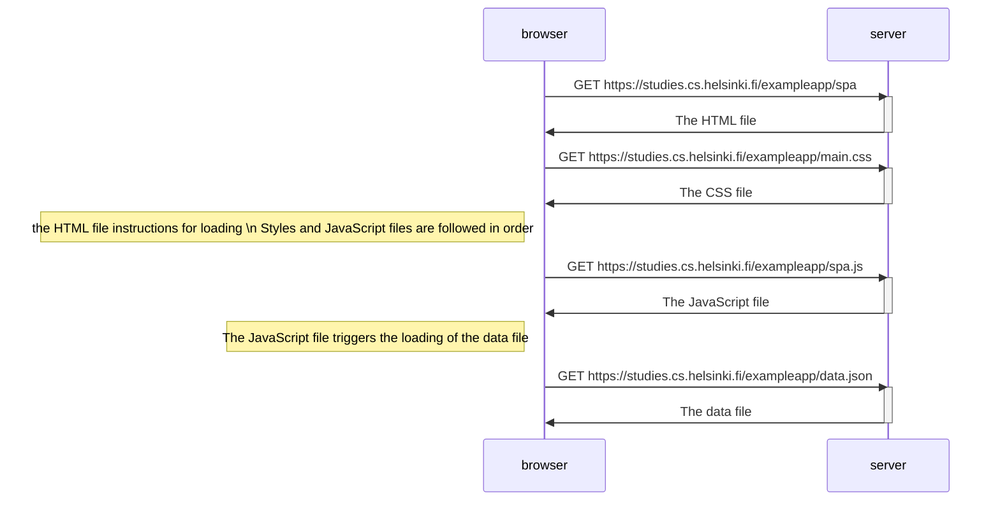

```mermaid
sequenceDiagram
participant browser
participant server

browser ->> server : GET https://studies.cs.helsinki.fi/exampleapp/spa
activate server
server ->> browser : The HTML file 
deactivate server

browser ->> server : GET https://studies.cs.helsinki.fi/exampleapp/main.css
activate server
server ->> browser : The CSS file 
deactivate server

Note left of browser: the HTML file instructions for loading \n Styles and JavaScript files are followed in order

browser ->> server : GET https://studies.cs.helsinki.fi/exampleapp/spa.js
activate server
server ->> browser : The JavaScript file 
deactivate server

Note left of browser: The JavaScript file triggers the loading of the data file
browser ->> server : GET https://studies.cs.helsinki.fi/exampleapp/data.json
activate server
server ->> browser : The data file 
deactivate server
```
